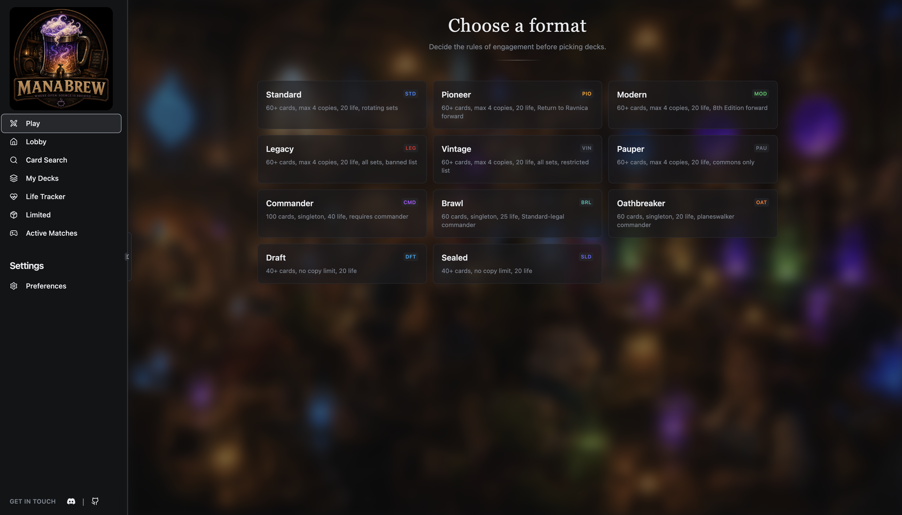
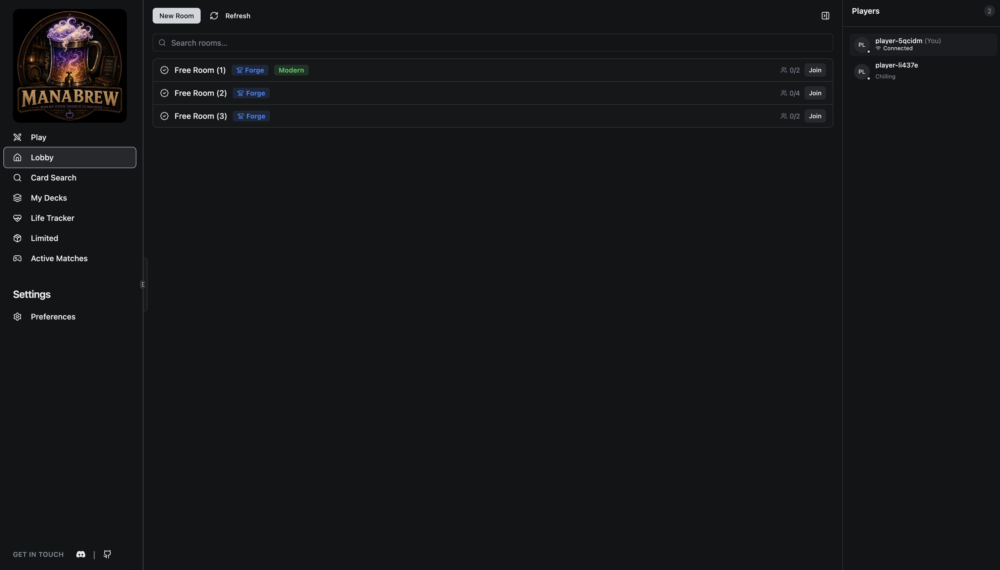

<h1 align="center">Manabrew</h1>

<p align="center">
  <strong>An open-source Magic: The Gathering client and rules engine, built around <a href="https://github.com/Card-Forge/forge">Forge</a> compatibility.</strong>
</p>

<p align="center">
  <a href="https://play.manabrew.app"></a>
  &nbsp;
  <a href="https://docs.manabrew.app"></a>
  &nbsp;
  <a href="https://discord.gg/NqrKpbhtcd"></a>
  &nbsp;
  <a href="./CONTRIBUTING.md"></a>
  &nbsp;
  <a href="./LICENSE.md"></a>
</p>

<table align="center">
  <tr>
    <td align="center" width="25%">
      <a href="./images/screenshots/my-decks.png"></a>
    </td>
    <td align="center" width="25%">
      <a href="./images/screenshots/deck-editor-grid.png"></a>
    </td>
    <td align="center" width="25%">
      <a href="./images/screenshots/format-select.png"></a>
    </td>
    <td align="center" width="25%">
      <a href="./images/screenshots/lobby.png"></a>
    </td>
  </tr>
</table>

> [!NOTE]
> This is unofficial fan software. It is not affiliated with, endorsed by, or
> sponsored by Wizards of the Coast LLC or by the Forge project. Magic: The
> Gathering, card names, rules text, and related marks are property of Wizards
> of the Coast LLC. Forge is developed by the Forge contributors. Card images
> are not shipped by this project.

---

## Community

- **App** — play the current build at <https://play.manabrew.app>.
- **Website & docs** — <https://manabrew.app> and <https://docs.manabrew.app>.
- **Discord** — ask questions, share decks, report rough edges, and follow
  development at <https://discord.gg/NqrKpbhtcd>.

## Contents

- [What This Is](#what-this-is)
- [Current Status](#current-status)
- [Getting Started](#getting-started)
- [Common Commands](#common-commands)
- [Architecture](#architecture)
- [Parity Harness](#parity-harness)
- [Engine Notes](#engine-notes)
- [Background](#background)
- [Contributing](#contributing)
- [License](#license)

---

## What This Is

`Manabrew` is a React/Tauri client and Rust rules-engine project for playing
Magic online. It uses Forge as the rules reference instead of defining a new
interpretation of the game.

The repository includes:

- a desktop client, web client, deck tools, and multiplayer runtime;
- a Rust port of Forge's game engine;
- Java Forge interop for Forge-backed games through the same client stack;
- a parity harness that compares Rust and Java Forge with the same decks, seed,
  and deterministic choices.

> [!TIP]
> The Rust engine is still catching up to Forge. The client stack can also drive
> Java Forge-backed sessions, which gives the project a usable path while Rust
> parity work continues.

## Start playing online now - for free

To get started visit our [landing page](https://manabrew.app)

## Current Status

`Manabrew` is pre-release software.

- The client and Java Forge backend path are the most practical way to play
  today.
- The Rust engine works for selected matchups, but broad card coverage is still
  in progress.
- Engine work is driven by parity testing against Java Forge.
- Packaging, contributor onboarding, and release-readiness work are ongoing.

---

## Getting Started

### Prerequisites

- Node.js 22.12+ recommended
- Yarn v1
- Rust stable
- Java 18 and Maven for Java Forge parity runs
- Platform prerequisites for [Tauri](https://tauri.app/start/prerequisites/)

### Clone with submodules

The Java reference engine and all card scripts live in the `forge` submodule, so
clone with `--recurse-submodules`:

```bash
git clone --recurse-submodules https://github.com/witchesofthehill/manabrew.git
```

If you already cloned without it, initialize the submodule before building:

```bash
git submodule update --init --recursive
```

### Install

```bash
yarn install
```

### Update the Forge submodule

The `forge` submodule is the whole Forge tree — the Java reference engine plus
card scripts, editions, and token data. Pull the latest commit (it tracks the
`manabrew` branch — see `.gitmodules`) with:

```bash
git submodule update --remote forge
```

Then rebuild so the new submodule content is picked up — the Java harness, the
WASM engine, and the bundled card archives all build from `forge/`. Skipping
this leaves stale builds; one visible symptom is the deck loader stripping any
card missing from the bundle.

```bash
yarn build:harness   # rebuilds the Java harness + restages the Tauri card bundle
yarn web             # rebuilds the WASM engine and card archive (yarn dev does too)
```

Committing the resulting submodule pointer bump (`git status` shows `M forge`) is
a normal change — open a PR for it like any other.

### Run the desktop app

```bash
yarn dev
```

### Run the web build

```bash
yarn web
```

### Build

```bash
yarn build
```

### Check formatting, types, and lints

```bash
yarn lint:all
```

## Common Commands

| Command                | What it does                                           |
| ---------------------- | ------------------------------------------------------ |
| `yarn dev`             | Start the Tauri desktop app in development mode        |
| `yarn web`             | Build the WASM engine and start the web client         |
| `yarn build`           | Build the desktop app                                  |
| `yarn build:web`       | Build the web app                                      |
| `yarn build:harness`   | Build the Java Forge parity harness                    |
| `yarn parity`          | Run named parity scenarios                             |
| `yarn parity:test --`  | Run the parity binary with custom arguments            |
| `yarn parity:gui`      | Start the engine debugger                              |
| `yarn lint:all`        | Run frontend lint/typecheck and Rust fmt/clippy checks |
| `yarn import-deck ...` | Import a deck from Archidekt or Moxfield               |

---

## Architecture

```text
React UI                    src/
Tauri desktop shell          src-tauri/
Web/WASM engine bridge       manabrew-rs/crates/wasm/
Headless runtime             manabrew-rs/crates/self-hosted-node/
Relay / lobby server         manabrew-rs/crates/manabrew-server/
Agent protocol DTOs          manabrew-rs/crates/manabrew-agent-interface/
Rust rules engine            manabrew-rs/crates/manabrew-engine/
Card database + script IR    manabrew-rs/crates/forge-carddb/
Forge Java reference         forge/
Parity harness               manabrew-rs/crates/parity/
```

The deeper engine workspace map is in
[manabrew-engine/README.md](./manabrew-engine/README.md).

## Parity Harness

Most engine work starts with a failing parity run:

```bash
yarn build:harness
yarn parity:test -- --deck1 red_burn --deck2 green_stompy --seed 42 --max-turns 20
```

The harness runs Rust and Java Forge with the same inputs, compares trace
snapshots, and reports the first mismatch. A good fix restores the missing
general rule in Rust by reading the corresponding Java file, not by special
casing the card that exposed the bug.

Start here:

- [Parity Testing Guide](./docs/PARITY_TESTING.md)
- [Engine Bugfix Workflow](./docs/agents/ENGINE_BUGFIX_WORKFLOW.md)
- [Parity Philosophy](./docs/agents/PARITY_PHILOSOPHY.md)

## Engine Notes

Forge card scripts are the compatibility contract. The Rust engine mirrors Java
Forge behavior, but it can use Rust-native data structures and typed internal
representations when behavior stays the same.

The main example is compiled IR for high-risk card-script semantics: produced
mana, defined-object references, numeric expressions, selectors, costs, and
similar domains. This is an implementation difference, not a game-behavior
difference. SVar resolution remains late-bound and follows the current
host-card state.

See [Forge Parity and IR](./docs/PARITY_AND_IR.md) and the SVar semantics
in [docs/forge-dsl-semantics.md](./docs/forge-dsl-semantics.md).

---

## Background

<details>
<summary><strong>Why This Exists</strong></summary>

The project started because a small group of friends wanted a modern, open way
to play Magic online together. Existing tools solve different parts of that
problem well, and Forge in particular provides the rules knowledge this project
depends on. `Manabrew` explores a different client, runtime, and deployment
shape while preserving Forge compatibility.

</details>

<details>
<summary><strong>Why Rust?</strong></summary>

Forge has years of rules knowledge and a very large card-script corpus. Rust
lets this project target:

- desktop app through Tauri;
- web/WASM builds for browser-based play;
- headless engine hosts for self-hosted multiplayer;
- deterministic traces for debugging, regression testing, and AI work;
- typed internal representations for hot or high-risk card-script semantics.

</details>

<details>
<summary><strong>Relationship With Forge</strong></summary>

Forge is the foundation of this project.

- The Java Forge source under `forge/` is the reference implementation.
- The Rust engine mirrors Forge's rules structure and consumes Forge card
  scripts.
- The parity harness keeps behavior faithful to Forge.
- The engine and bundled card data are derivative of Forge (GPL-3.0-or-later);
  this project's own code is AGPL-3.0-or-later (a GPL-compatible license that
  also covers network use). The vendored `forge/` tree stays GPL-3.0-or-later.

This is an independent fan project. Forge maintainers are not expected to review
or support this work.

See [Forge Parity and IR](./docs/PARITY_AND_IR.md) and
[Third-Party Notices](./THIRD-PARTY-NOTICES.md). For related projects and
ecosystem context, see [Ecosystem](./docs/ECOSYSTEM.md).

</details>

---

## Contributing

The most useful contributions are small, well-scoped parity fixes,
documentation improvements, UI bug fixes, and reproducible issue reports.

Before opening a PR, read [CONTRIBUTING.md](./CONTRIBUTING.md). In short:

- work from an issue or open one first for larger changes;
- use Conventional Commit messages;
- sign commits with a DCO `Signed-off-by:` trailer;
- for engine fixes, read the Java Forge counterpart before editing Rust;
- run `yarn lint:all` before asking for review;
- do not bundle card images or secrets.

### AI-Assisted Development

This repository welcomes the use of AI assistance for mechanical porting, parity
investigation, trace analysis, documentation, and large-scale inventory work. AI
output is treated as code written by a contributor: it must be well thought of, reviewed, and properly tested.

Do not push code you don't understand.

See [AI Usage](./docs/AI_USAGE.md).

## License

The project is licensed under **AGPL-3.0-or-later**, to close GPL's network
loophole for the hosted instance. AGPL is GPL-compatible, so this is additive;
the vendored `forge/` tree stays GPL-3.0-or-later under its upstream terms.
`docs/PROTOCOL.md` remains CC-BY-4.0.

See [LICENSE.md](./LICENSE.md),
[LICENSE-AGPL-3.0-or-later](./LICENSE-AGPL-3.0-or-later),
[LICENSE-GPL-3.0-or-later](./LICENSE-GPL-3.0-or-later),
and [THIRD-PARTY-NOTICES.md](./THIRD-PARTY-NOTICES.md).

---

<div align="center">
  <sub>Built by the Manabrew contributors · AGPL-3.0-or-later</sub>
</div>
